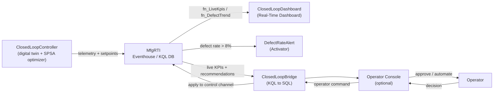

A **live, self-optimizing manufacturing line** built entirely on Microsoft Fabric Real-Time Intelligence. A fleet of injection-molding machines streams sensor data; an **SPSA optimizer** continuously tunes each machine's setpoints toward a *moving* quality target; and the whole control loop closes in real time — autonomously for **auto** machines, and with human approval for **supervised** ones.

<Callout>

💡 **Measure → Analyze → Decide → Act → repeat.** Unlike a dashboard that only *reports* on data, this solution *changes its own inputs* and you watch quality (defect rate) improve as a direct result — the classic closed loop of process control.

</Callout>

## 🔁 What is closed-loop optimization?

In an open loop, sensors report a problem and a human reacts. In a **closed loop**, the system acts on its own measurements to steer a process toward a goal — continuously, without waiting for a person:

1. **Measure** — machines emit telemetry (parts, defects, temperature, pressure, vibration).
2. **Analyze** — KQL turns the raw stream into live KPIs and a defect-rate trend.
3. **Decide** — an optimizer estimates which setpoint change lowers the defect rate.
4. **Act** — the new setpoints are applied automatically (**auto**) or proposed for a human to approve (**supervised**).
5. **Repeat** — because the quality optimum keeps drifting, the loop never "finishes" — it perpetually re-converges, just like real process control fighting tool wear and material variation.

## ✨ What's Inside

- 🔥 **Eventhouse / KQL Database (`MfgRTI`)** — a telemetry stream, a `Setpoints` **control channel** (writing a setpoint row is how the loop closes), an optimizer decision log, and KPI functions (`fn_LiveKpis`, `fn_DefectTrend`, `fn_FleetSummary`, `fn_PendingRecommendations`, `fn_RecentAutoActions`).
- 📓 **`ClosedLoopController` (Notebook)** — a **digital-twin plant** with a hidden, drifting optimum, driven by an **SPSA optimizer** (Simultaneous Perturbation Stochastic Approximation) that only sees the defect rate and steers temperature/pressure downhill within a safe operating envelope.
- 📓 **`ClosedLoopBridge` (Notebook)** — a Spark-native KQL ⇄ SQL bridge that applies operator decisions back to the control channel and republishes live KPIs (and an activity feed) for the operator console.
- 📊 **`ClosedLoopDashboard` (Real-Time Dashboard)** — fleet defect-rate trend with an 8% threshold line, live per-machine KPIs, optimizer activity, and pending recommendations.
- 🚨 **`DefectRateAlert` (Activator / Reflex)** — fires when any machine's defect rate crosses above 8%.
- 🛠️ **`PostDeploymentNotebook`** — one click to seed history and run the demo live.

## 🏛️ Architecture

## Auto vs. Supervised — the story to tell

The fleet is four injection-molding machines (`IMM-01` … `IMM-04`). By default **one machine runs fully autonomously** and the **other three start supervised**, so you can demonstrate the hand-off live:

- **Auto machines** self-optimize with no human involvement. As the optimum drifts, the optimizer keeps nudging setpoints and the defect rate stays low (~2–3%).
- **Supervised machines** *hold* their setpoints and only *recommend* a change — their defect rate stays elevated while recommendations accumulate, waiting for a human.
- **Flip a supervised machine to Auto** (in the operator console) and watch the optimizer take over: within a few ticks the defect rate falls from double digits down to ~2–3%, and the action is logged in the **activity feed** (`auto-optimized`).

<Callout>

This is the money moment of the demo: a machine sitting at 15–20% defects gets switched to Auto, and the closed loop visibly drives it down on its own — no code, no manual setpoint math.

</Callout>

## 📦 Prerequisites

- **Microsoft Fabric capacity** — F2 or higher (a Fabric Trial capacity also works for the Real-Time Intelligence core).
- **Fabric workspace** — with contributor or admin permissions, assigned to the capacity above.
- The [`fabric-jumpstart`](https://pypi.org/project/fabric-jumpstart/) Python package (`pip install fabric-jumpstart`) — or run the install from a Fabric notebook, where it is already available.

## ▶️ Run it

After installing, open **`PostDeploymentNotebook`** in the workspace and click **Run all**. It will:

1. ✅ Seed ~2 hours of convergence history so the dashboard has depth immediately (a fast backfill of past-dated data — not two hours of runtime).
2. ✅ (Optionally) deploy the operator console app and wire the human-in-the-loop approval path.
3. ✅ Run the demo **live** — the controller generates telemetry continuously while the bridge publishes KPIs every ~10 seconds. The live window defaults to **`GENERATE_MINUTES = 30` minutes** to keep capacity usage predictable; raise it (e.g. `120`) for a longer run, or simply re-run the final cell for more.

Within a minute or two, open **`ClosedLoopDashboard`** and watch the loop work.

## 🎉 What you'll see (outcomes)

- **Auto machine** converges toward **~2–3% defects** and stays there even as the hidden optimum drifts.
- **Supervised machines** hold at an elevated defect rate; their proposed setpoints appear as **pending recommendations**.
- **`DefectRateAlert`** fires when a machine crosses **8%** defects.
- After you **switch a supervised machine to Auto**, its defect rate visibly falls and an **`auto-optimized`** entry appears in the activity feed.

To keep the loop running long-term instead of the built-in live window, **schedule `ClosedLoopController`** every ~10 minutes and **`ClosedLoopBridge`** every ~5 minutes.

## 🖥️ Optional — Operator Console (human-in-the-loop)

The full experience includes a Fabric-authenticated **operator console** (a React app) and the **KQL ⇄ SQL bridge** that let an operator *approve* a supervised machine's recommendation — or *automate* it — with one click. The console's app source ships in the repo and is deployed from the `PostDeploymentNotebook`; it is entirely optional, and the Real-Time Intelligence core runs without it.

## 📁 Folder Organization

| Folder | Purpose |
| --- | --- |
| `Develop/` | 📓 Notebooks — controller (twin + optimizer), bridge, post-deployment |
| `Eventhouse/` | 🔥 `MfgRTI` Eventhouse + KQL Database (telemetry, setpoints, KPIs) |
| `Reporting/` | 📊 `ClosedLoopDashboard` Real-Time Dashboard |
| `Activator/` | 🚨 `DefectRateAlert` Reflex |
| `optional-operator-console/` | 🖥️ Operator console app source (optional) |
| `parameter.yml` | 🎛️ Environment-specific parameter overrides |

## 📄 License

Provided as-is for demonstration and educational purposes.
