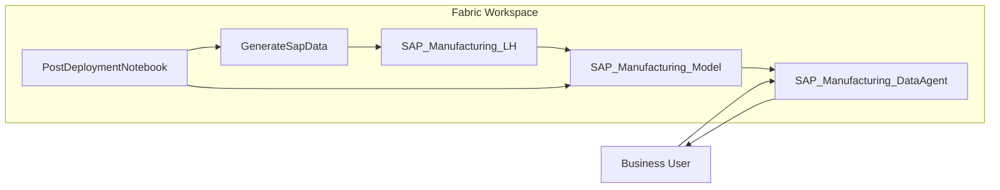

Turn a lakehouse of synthetic **SAP PP / shopfloor** data into a natural-language
analytics experience. A grounded Fabric **Data Agent** answers questions about
production orders, the *Laser Balancing* bottleneck, missing parts, scrap,
throughput and S&OP on top of a **Direct Lake** semantic model - with no real SAP
system, connection, or extract required.

<Callout>

Everything - lakehouse, notebooks, the Direct Lake semantic model, and the data
agent - is deployed by **fabric-cicd** from the git tree. After deploy, one
**Run all** on the entry-point notebook seeds the data and reframes the model.

</Callout>

## What it is

"Talk to your SAP data" is a frequent ask, but demos usually need a live SAP
connection and a hand-built model. This jumpstart is fully self-contained: an
in-notebook synthesizer generates coherent SAP PP tables, a Direct Lake model
exposes SAP business measures, and a Fabric Data Agent is grounded on that model
with detailed production-control instructions. The result is a screenshot-worthy
hero moment - ask a question in plain language, get a grounded, SAP-terminology
answer.

## Architecture



## What gets deployed

| Item | Type | Purpose |
| --- | --- | --- |
| `SAP_Manufacturing_LH` | Lakehouse | Holds 17 synthetic SAP Delta tables. |
| `GenerateSapData` | Notebook | Synthesizes the SAP tables (material master, orders, operations, confirmations, missing parts, movements, work centers, S&OP). |
| `SAP_Manufacturing_Model` | Semantic model | Direct Lake model with SAP business measures (released order load, backlog, missing parts, scrap rate, bottleneck load, average posting delay). |
| `SAP_Manufacturing_DataAgent` | Data Agent | Grounded on the model with detailed SAP PP / production-control / bottleneck-analysis instructions. |
| `PostDeploymentNotebook` | Notebook | Entry point - seeds the data and reframes the Direct Lake model. |

The lakehouse carries the full SAP shopfloor story: material master (`MARA`,
`MARC`, `MARD`, `D_Part`, `MRP_Cntr`, `ProductHierarchy`, `ProductGroup`),
production orders (`COOIS_OrderHeaders`, `COOIS_OrderOperations`), confirmations
(`COOIS_Confirmations`), missing parts (`CO24`), material movements (`MATDOC`,
`MovementTypes`), work centers incl. the *Laser Balancing* bottleneck
(`WorkCenters`, `ActivityTypes`) and S&OP (`SOP_Targets`, `tmp_PartStockV1`).

## How it works

The semantic model and data agent are **git-format items** deployed by
fabric-cicd - they are not built by a notebook at runtime. Their
workspace-specific ids are placeholders that `parameter.yml` resolves at deploy
time, so the jumpstart is portable to any workspace with no manual edits:

- The Direct Lake expression (`__WORKSPACE_ID__` / `__LAKEHOUSE_ID__`) is bound to
  the deployed lakehouse via `$workspace.$id` and
  `$items.Lakehouse.SAP_Manufacturing_LH.$id`.
- The data agent's datasource (`__WORKSPACE_ID__` / `__SEMANTIC_MODEL_ID__`) is
  bound to the deployed model via `$workspace.$id` and
  `$items.SemanticModel.SAP_Manufacturing_Model.$id`.

fabric-cicd publishes the lakehouse and model before the agent, so every
cross-reference resolves. The `PostDeploymentNotebook` then completes the two
steps that need the live lakehouse: it runs `GenerateSapData` to write the tables,
then reframes the Direct Lake model so it picks them up (nudging the SQL analytics
endpoint metadata sync and retrying with backoff).

## Install

```python
%pip install fabric-deployment-tool
import fabric_jumpstart as js

# From the catalog registry
js.install("sap-manufacturing")
```

Or install straight from the source repository tag:

```python
import fabric_jumpstart as js

js._install_from_github(
    logical_id="sap-manufacturing",
    repo_url="https://github.com/DaSenf1860/jumpstart-sap-manufacturing.git",
    repo_ref="v1.0.0",
    entry_point="PostDeploymentNotebook.Notebook",
    items_in_scope=["Lakehouse", "Notebook", "SemanticModel", "DataAgent"],
    workspace_path="sapmanufacturing/",
)
```

## Run it

1. Open **`PostDeploymentNotebook`** and select **Run all**. It discovers the
   workspace and lakehouse, generates the SAP data, and reframes the Direct Lake
   model. Wait for the final `POST_DEPLOY_DONE` message.
2. Open **`SAP_Manufacturing_DataAgent`** and start asking questions.

## Example questions

- *How many production orders are released, and how many are in backlog?*
- *How many operations sit at the Laser Balancing bottleneck?*
- *Which orders are waiting on missing parts and what is the total shortage?*
- *Which product group has the highest scrap rate?*
- *What is the average posting delay between actual completion and SAP posting?*

## Requirements

- A Microsoft Fabric capacity (F2+ or Trial) with Data Agents enabled in the
  tenant.
- Contributor or higher access to the target workspace.
- Permission to create semantic models and Data Agents.

## Resources

- [Source repository](https://github.com/DaSenf1860/jumpstart-sap-manufacturing)
- [Microsoft Fabric Data Agent documentation](https://learn.microsoft.com/fabric/data-science/concept-data-agent)
- [Direct Lake overview](https://learn.microsoft.com/fabric/fundamentals/direct-lake-overview)
